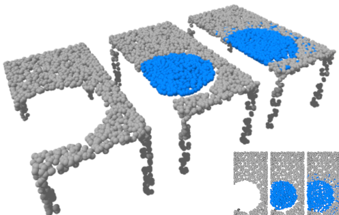
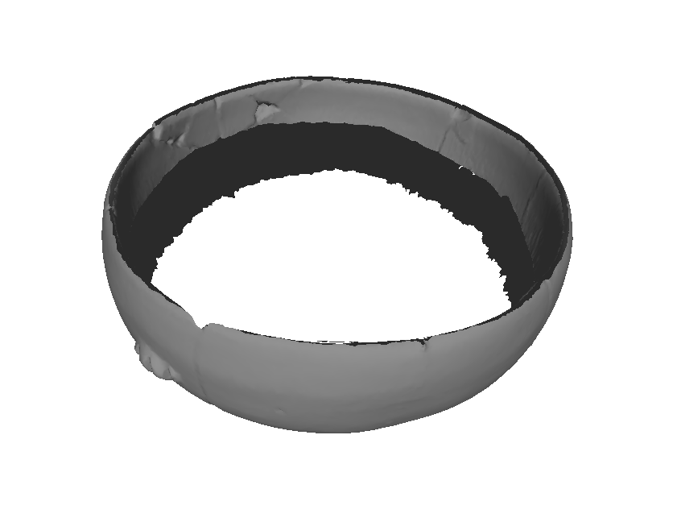
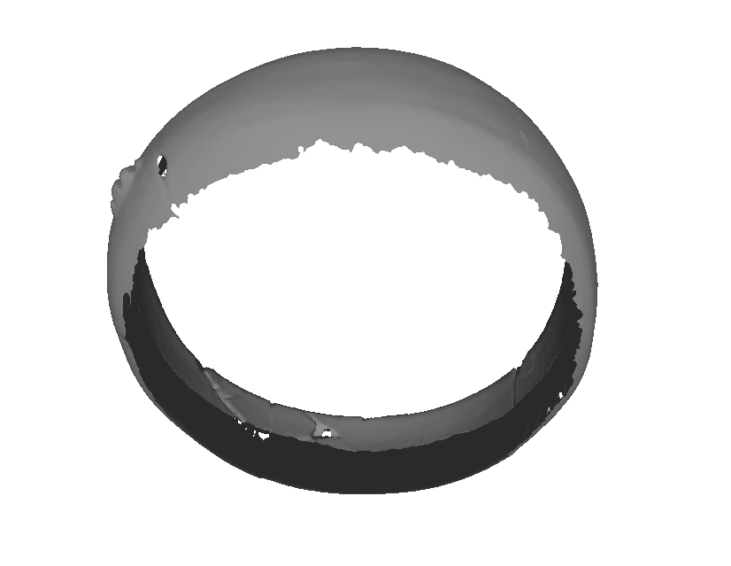
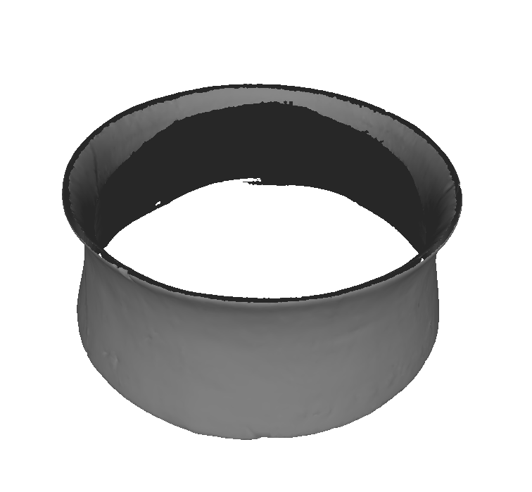
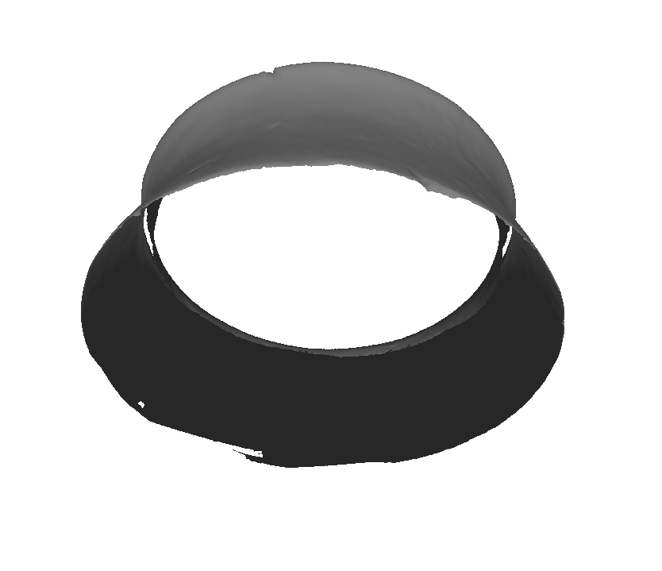

# Data-driven Restoration of Cultural Heritage Objects with Point Cloud Analysis
Pytorch code for the paper "Data-driven Restoration of Cultural Heritage Objects with Point Cloud Analysis".

Given a partial input, our method predicts and refine the missing part to obtain an integrated completed point cloud.

## Setup
We use Ubuntu 18.04 with Python 3.6.9. and CUDA 10.2. Follow the next instructions to establish the environment.

1. Create an environment
~~~
python -m venv Refinement --system-site-packages
source Refinement/bin/activate
~~~

2. Install dependencies
~~~
pip install torch==1.3.1 torchvision
pip install -r requirements.txt
~~~

## ShapeNet Experiments
### 1. Download the ShapeNet dataset
~~~
cd data
bash get_dataset.sh
~~~

### 2. Compile the extension modules
~~~
cd extensions/chamfer_dist
python setup.py install

cd losses/emd
python setup.py install
~~~

### 3. Train a network
We use Visdom to see the training progress. Therefore, before training, we need to start a visdom server with the command:

~~~
visdom -port 8997
~~~

Port 8997 is used by default by our training scripts. If you want to use a different port, be careful to change the parameter in the training scripts.

To train our model, use the command:
~~~
python train_MBD.py --model=MBD_SHAPENET
~~~

The trained model and training log will be stored in the folder ./log/MBD_SHAPENET. Please check the Python code to set other parameters such as batch size or number of epochs. Parameters by default were used to get the paper's results.

We also provide the Python code to train our MLP variant (train_MLP.py), the fully convolutional auto_encoder (train_FCAE.py) and the MSN method (train_MSN.py). Just note that MSN method requires Pytorch 1.2 and the compilation of losses/chamfer, losses/expansion_penalty, and losses/MDS.

### 4. Evaluation
Download the pretrained models from [here](https://drive.google.com/drive/folders/14i51epgfmftfBY4R569XZl6Ia9GLWJA_?usp=sharing). To evaluate the methods and get the results reported in the paper, you must proceed as follows:

1. Perform the evaluation of our model first using the script *evaluate_model.sh*. The evaluation of our model creates a set random input shapes and store them in a folder. This test set must be used by the other evaluation scripts to make a fair comparison. 

2. Perform the evaluation of compared methods using the command:
    ~~~
    python shapenet_model_evaluation_FCAE.py --model=pretrained/FCAE_SHAPENET/ --inputTestFolder=Results/
    ~~~

Optionally, you can also save the results of the compared methods by setting the option --outputFolder in the evaluation scripts.

## Repair of Cultural Heritage Objects
### 1. The dataset
Download the CH dataset from [here](https://drive.google.com/file/d/1PEqrrz_FAKFEFb8GT6HNcjpGvi7JsOdq/view?usp=sharing). Locate the folder "datasetCH" inside the folder "data" of this repository.

### 2. Training
To train the model, execute:

~~~
python train_MBD_Cultural_Heritage.py --model=MBD_CH
~~~

The final trained model will be stored under the folder "log".

### 3. Application on repair of cultural heritage objects

Download the pre-trained neural network from [here](https://drive.google.com/file/d/1-Pbl3RUprMbaEbpQxvRWjxtV4wJobo0b/view?usp=sharing). Also download the scanned 3D models with imperfections from [here](https://drive.google.com/file/d/1VQI0pLsznhn62QL_aZxJqlBRnu33h0o6/view?usp=sharing). Install [Meshlab](https://www.meshlab.net/) and be sure to include the folder with the binary of "meshlabserver" in the system path. Meshlabserver is used by our application to perform the Poisson reconstruction of the point clouds.

Execute the repair tool with the next command:

~~~
python completePipeline.py --object=<name_object> --inputFolder=<folder with scanned objects> --model=<pretrained model> --outputFolder=<where the result will be> --save --ratio=<threshold for keeping geometry from reconstruction>
~~~

An example of execution:

~~~
python completePipeline.py --object=0001 --inputFolder=data/scanned/ --model=pretrained/MBD_CH_pretrained --outputFolder=finalResult/ --save --ratio=0.3
~~~

The output of this script will be in the "finalResult/" folder. The script also shows the reconstruction using a 3D viewer. 

